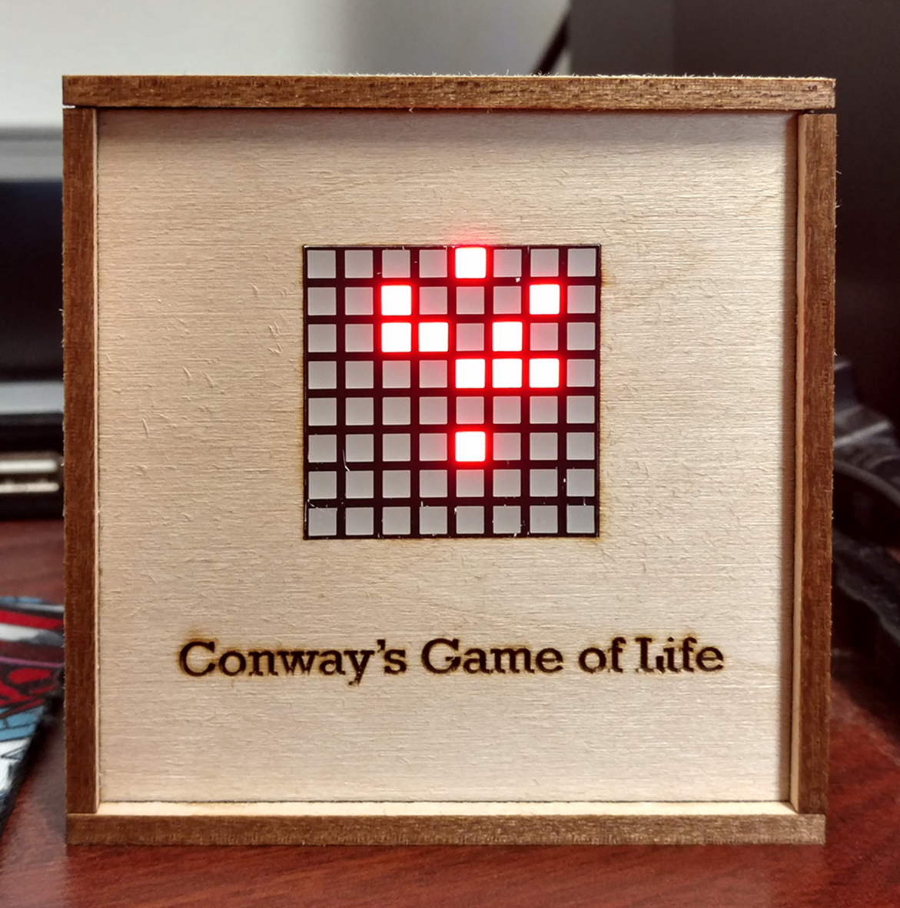
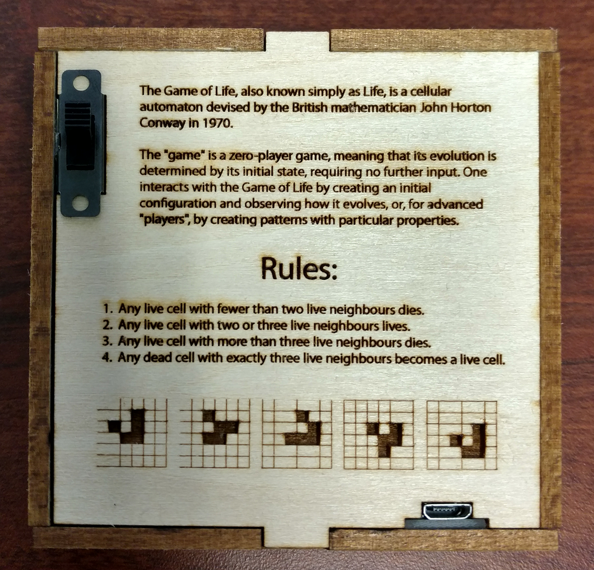
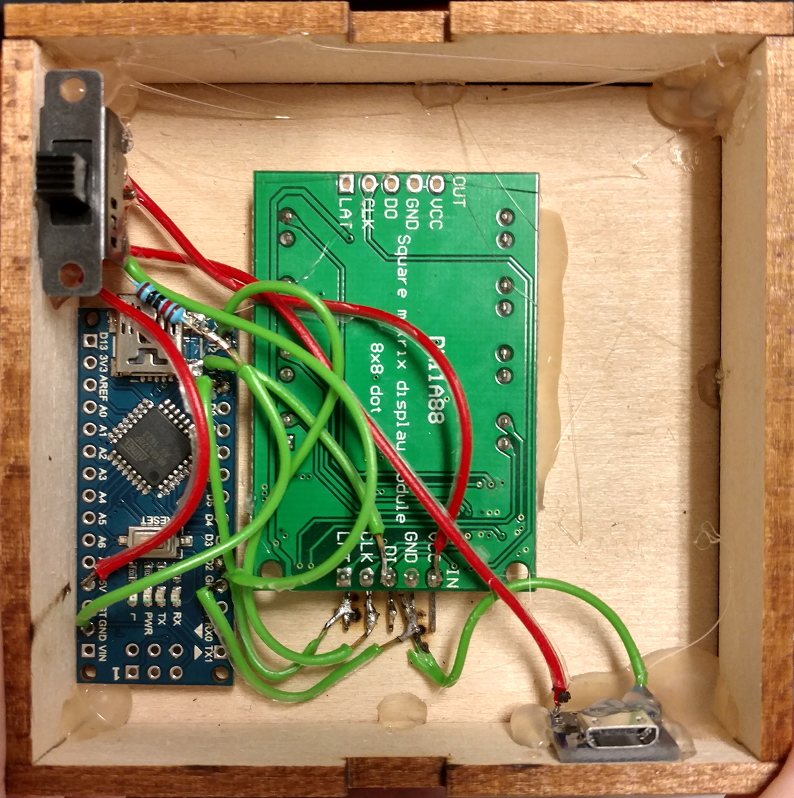

# Desktop Game of Life using an 8x8 Matrix

This is a small 8x8 version of [Conway's Game of Life](https://en.wikipedia.org/wiki/Conway%27s_Game_of_Life) running on an [Arduino Nano](https://store.arduino.cc/usa/arduino-nano#:~:text=The%20Arduino%20Nano%20is%20a,instead%20of%20a%20standard%20one.) and displayed on a [DM11A88 8x8 LED Matrix](https://www.amazon.com/Square-DM11A88-Display-Module74hc595-Arduino/dp/B07T3PY8SW).

I included the Adobe Illustrator file that I used to lasercut a 1/8 inch piece of basswood to build the enclosure.

The device is powered from a USB Micro B port. A 3 position toggle switch is used to set the devices into one of 3 modes:
* Off
* On with borders
* On without borders (the bottom and top and left and right edges of the array are stitched together, yielding an toroidal array)

